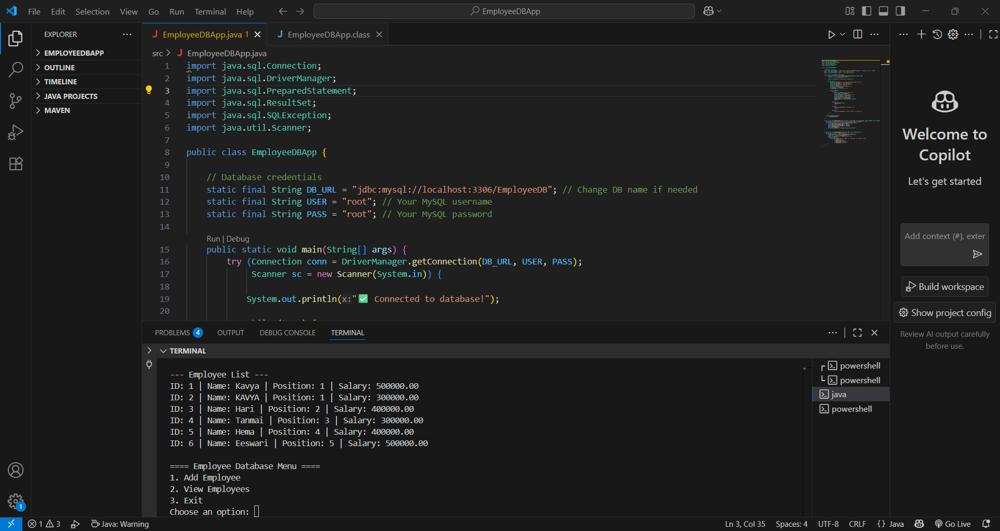

# JavaEmployeeCLI  

A beginner-friendly Java command-line application to manage employee records using MySQL. Quickly add, view, and manage employee data with an easy text-based interface.  

## 📸 Screenshot  
  

## 📖 Features  
- Add new employee details to the database  
- View all employees in a clear tabular format  
- Simple and intuitive command-line interface  

## 🛠 Requirements  
- Java JDK installed (version 8 or later)  
- MySQL installed and running  
- MySQL Connector/J `.jar` file (e.g., `mysql-connector-j-9.4.0.jar`)  

## 🚀 How to Run  
1. Clone this repository or download the files.  
2. Place the `mysql-connector-j-9.4.0.jar` in a `lib` folder.  
3. Open a terminal/command prompt in the project folder.  
4. Compile the program:  
   ```bash
   javac -cp "lib/mysql-connector-j-9.4.0.jar;." src/EmployeeDBApp.java
   java -cp "lib/mysql-connector-j-9.4.0.jar;.;src" EmployeeDBApp

**Feel free to fork this repo and explore Java with JavaEmployeeCLI, Puchalapalli Eeswari Devi! 🚀**
